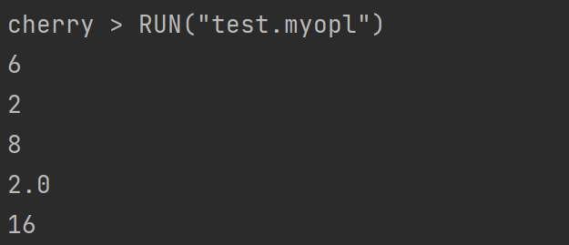
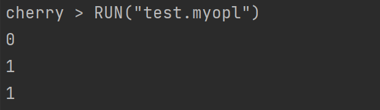
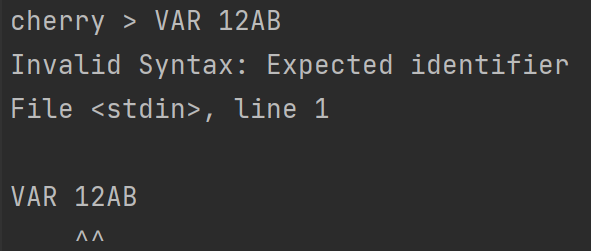
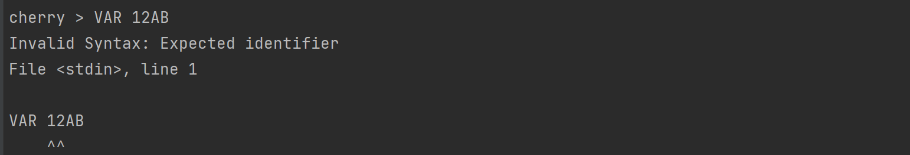

##  1 新定义语言的背景和目标

##  2 词法和语法设计
### 2.1 基本数据类型
下面是数值类型的EBNF
```javascript
valueType ::= <INT> | <FLOAT> | <STRING> 
INT ::= [+|-] <digit>
FLOAT ::= <digit>+ '.' <digit>+
STRING ::= [<letter>| <digit>] *
digit ::= [0-9]
letter ::= [a-z] | [A-Z]

```

### 2.2 变量
>变量是存储在内存中的值，这就意味着在创建变量时会在内存中开辟一个空间。 基于变量的数据类型，解释器会分配指定内存，并决定什么数据可以被存储在内存中。
变量可以指定不同的数据类型，这些变量可以存储整数，小数或字符串。

>Cherry中的变量赋值不需要类型声明。每个变量在使用前都必须赋值，变量赋值以后该变量才会被创建。
等号 `=` 用来给变量赋值。 等号 `=` 运算符左边是一个变量名，等号 `=` 运算符右边是存储在变量中的值。
```javascript
digit ::= [0-9]
letter ::= [a-z]
        | [A-Z]
identifier ::= [<letter>| '_'] [<letter> | <digit> | '_' ]*
```

### 2.3 运算符
#### 2.3.1 算数运算符
以下假设变量a为10，变量b为20：


| 运算符符 | 描述                  | 实例                                                         |
|------|---------------------|------------------------------------------------------------|
| +    | 加 - 两个对象相加          | a + b 输出结果 30                                              |
| -    | 减 - 得到负数或是一个数减去另一个数 | a - b 输出结果 -10                                             |
| *    | 乘 - 两个数相乘或是对列表进行拼接  | a * b 输出结果 200;  <br/> [1,2,3] * [4,5,6] 输出结果[1,2,3,4,5,6] |
| /    | 除 - x除以y            | b / a 输出结果 2                                               |
| ^    | 幂 - 返回x的y次幂         | a^b 为10的20次方， 输出结果10000000000000000000                     |

#### 2.3.2 比较运算符
以下假设变量a为10，变量b为20：

| 运算符  | 	描述 	                                                          | 实例                             |
|------|----------------------------------------------------------------|--------------------------------|
| ==   | 	等于 - 比较对象是否相等	                                                | (a == b) 返回 False。             |
| !=	  | 不等于 - 比较两个对象是否不相等                                              | 	(a != b) 返回 True。             |
| \>	  | 大于 - 返回x是否大于y                                                  | (a > b) 返回 False。              |
| <	   | 小于 - 返回x是否小于y。所有比较运算符返回1表示真，返回0表示假。这分别与特殊的变量 True 和 False 等价。	 | (a < b) 返回 True。               |
| \>=	 | 大于等于 - 返回x是否大于等于y。	                                            | (a >= b) 返回 False。             |
| <=	  | 小于等于 - 返回x是否小于等于y。	                                            | (a <= b) 返回 True。              |

#### 2.3.3 赋值运算符
以下假设变量a为10，变量b为20：

| 运算符符 | 描述       | 实例                           |
|------|----------|------------------------------|
| =    | 简单的赋值运算符 | c = a + b 将 a + b 的运算结果赋值为 c |

#### 2.3.4 逻辑运算符
以下假设变量a为10，变量b为20：

| 运算符	 | 逻辑表达式	  | 描述                                                    | 	实例                                                         |
|------|---------|-------------------------------------------------------|-------------------------------------------------------------|
| and  | x and y | 	布尔"与" - 如果 x 为 False，x and y 返回 False，否则它返回 y 的计算值。	 | (a and b) 返回 20。                                            |
| or	  | x or y	 | 布尔"或" - 如果 x 是非 0，它返回 x 的计算值，否则它返回 y 的计算值。            | 	(a or b)                                           返回 10。  |                                                   
| not	 | not x	  | 布尔"非" - 如果 x 为 True，返回 False 。如果 x 为 False，它返回 True。	 | not(a and b)                                       返回 False |                                                    

#### 2.3.5 运算符的优先级
以下表格列出了从最高到最低优先级的所有运算符：

| 运算符         | 	描述        |
|-------------|------------|
| ^	          | 指数 (最高优先级) |
| * / %       | 乘，除，取模     |
| + -         | 	加法减法      |
| <= < > >=	  | 比较运算符      |
| == !=	      | 等于运算符      |
| =	          | 赋值运算符      |
| not and or	 | 逻辑运算符      |


### 2.4 关键词
关键词是cherry预先保留的标识符,一共17个关键词，包括基本关键词、控制分支关键词。   
在定义变量或者常量时候，不能使用关键字，下表给出cherry所有token以及每个关键词所代表的含义

| 关键词  | 含义    | 关键词      | 含义    |
|------|-------|----------|-------|
| VAR  | 定义变量  | WHILE    | 循环关键词 | 
| FUN  | 定义函数  | FOR      | 循环关键词 |
| AND  | 与运算   | TO       | 循环关键词 |
| OR   | 或运算   | STEP     | 循环关键词 |
| NOT  | 非运算   | RETURN   | 函数返回  |
| IF   | 条件关键词 | CONTINUE | 继续循环  |
| ELSE | 条件关键词 | BREAK    | 退出循环  |
| ELIF | 条件关键词 | END      | 结束循环  |
| THEN | 条件关键词 |

### 2.5 常用内置函数
#### INPUT() 终端输入
```commandline
VAR a = INPUT()
# 将键盘中输入的字符串/浮点数赋给变量a
```
#### INPUT_INT() 终端输入整数
```commandline
VAR a = INPUT_INT()
# 将键盘中输入的整数赋给变量a。若输入非整数则报错，用户需要重新键入。
```
#### PRINT() 终端输出
```commandline
VAR a = 10
PRINT(a)
# 输出变量a
```
#### CLEAR() 终端清屏
```commandline
CLEAR()
# 清理终端屏幕
```
#### IS_NUM() 判断是否为number
```commandline
VAR a = 10
IS_NUM(a)
# 若为number，则返回1，否则返回0.
```
#### IS_STR() 判断是否为string
```commandline
VAR a = "asbj"
IS_STR(a)
# 若为string，则返回1，否则返回0.
```

#### IS_LIST() 判断是否为list
```commandline
VAR a = [a,b,c]
IS_LIST(a)
# 若为list，则返回1，否则返回0.
```

#### IS_FUN() 判断是否为function
```commandline
FUN function(b, c) -> b + c
IS_FUN(function)
# 若为function，则返回1，否则返回0.
```
#### APPEND(LIST list, item) LIST添加元素
```commandline
VAR list = [1,2,3]
APPEND(list,4)
# list = [1,2,3,4]
```

#### POP(LIST a, index) LIST POP元素
```commandline
VAR list = [1,2,3,4]
POP(list,3)
# 弹出list的第三个元素，即4
```
#### EXTEND(LIST a, LIST b)  拼接两个LIST
```commandline
VAR list = [1,2,3,4]
EXTEND(list,[5,6,7])
# 弹出list的第三个元素，即4
```

#### RUN("file") 
```
RUN("file")
#读入并运行文件file
```

#### LEN(elements) 
```
LEN(elements)
#返回list的长度
```


### 2.6 词法设计

### 2.7 语法设计
```commandline
statements  : NEWLINE* statement (NEWLINE+ statement)* NEWLINE*

statement		: KEYWORD:RETURN expr?
						: KEYWORD:CONTINUE
						: KEYWORD:BREAK
						: expr

expr        : KEYWORD:VAR IDENTIFIER EQ expr
            : comp-expr ((KEYWORD:AND|KEYWORD:OR) comp-expr)*

comp-expr   : NOT comp-expr
            : arith-expr ((EE|LT|GT|LTE|GTE) arith-expr)*

arith-expr  :	term ((PLUS|MINUS) term)*

term        : factor ((MUL|DIV) factor)*

factor      : (PLUS|MINUS) factor
            : power

power       : call (POW factor)*

call        : atom (LPAREN (expr (COMMA expr)*)? RPAREN)?

atom        : INT|FLOAT|STRING|IDENTIFIER
            : LPAREN expr RPAREN
            : list-expr
            : if-expr
            : for-expr
            : while-expr
            : func-def

list-expr   : LSQUARE (expr (COMMA expr)*)? RSQUARE

if-expr     : KEYWORD:IF expr KEYWORD:THEN
              (statement if-expr-b|if-expr-c?)
            | (NEWLINE statements KEYWORD:END|if-expr-b|if-expr-c)

if-expr-b   : KEYWORD:ELIF expr KEYWORD:THEN
              (statement if-expr-b|if-expr-c?)
            | (NEWLINE statements KEYWORD:END|if-expr-b|if-expr-c)

if-expr-c   : KEYWORD:ELSE
              statement
            | (NEWLINE statements KEYWORD:END)

for-expr    : KEYWORD:FOR IDENTIFIER EQ expr KEYWORD:TO expr 
              (KEYWORD:STEP expr)? KEYWORD:THEN
              statement
            | (NEWLINE statements KEYWORD:END)

while-expr  : KEYWORD:WHILE expr KEYWORD:THEN
              statement
            | (NEWLINE statements KEYWORD:END)

func-def    : KEYWORD:FUN IDENTIFIER?
              LPAREN (IDENTIFIER (COMMA IDENTIFIER)*)? RPAREN
              (ARROW expr)
            | (NEWLINE statements KEYWORD:END)

```

### 2.8 抽象语法树
抽象语法树（AST）是用编程语言编写的源代码的抽象语法结构的树表示。
树的每个节点表示在源代码中出现的构造。
语法是“抽象的”，因为它不代表真实语法中出现的每个细节，而只是结构，内容相关的细节。
例如，分组括号在树结构中是隐式的，并且可以通过具有三个分支的单个节点来表示类似于if-condition-then表达式的句法结构。
AST树每一层结构也被叫做节点(Node)。
下面列举比较重要的语句的抽象语法树，其中也包括一些算术表达式和比较表达式的抽象语法树：


##  3 范型的设计
### 3.1 分支语句
cherry条件语句是通过一条或多条语句的执行结果（True或者False）来决定执行的代码块。   
IF的EBNF
```
if-expr ::= 'IF' <expr> 'THEN'(<statement>[<if-expr-b>|<if-expr-c>])
         | (<NEWLINE> <statements> 'END'|<if-expr-b>|<if-expr-c>)

if-expr-b ::= 'ELIF' <expr> 'THEN'(<statement>[<if-expr-b>|<if-expr-c>])
           | (<NEWLINE> <statements> 'END'|<if-expr-b>|<if-expr-c>)

if-expr-c ::= 'ELSE'
          | <statement>
          | (<NEWLINE> <statements> 'END')

```
IF的DFA

IF的格式
```
IF expr THEN statement
ELIF expr1 THEN statement1
ELSE statement2 END
```
由于 cherry 并不支持 switch 语句，所以多个条件判断，可以通过 elif 来实现，如果判断需要多个条件需同时判断时，可以使用 or （或），表示两个条件有一个成立时判断条件成功；
使用 and （与）时，表示只有两个条件同时成立的情况下，判断条件才成功。

### 3.2 循环语句
程序在一般情况下是按顺序执行的。cherry编程语言提供了几种控制结构，允许更复杂的执行路径。循环语句允许我们执行一个语句或语句组多次
#### 3.2.1 FOR语句
每个for语句都包含两个部分：循环头和循环体。循环头控制循环体的执行次数，它由三个部分组成：一
个循环遍历初始化语句，一个循环范围，以及一个循环变量的增长步长。

for的EBNF
```javascript
for-expr ::= 'FOR' <identifier> '=' <expr> 'TO' <expr> ['STEP' <expr>] 'THEN'
         <statement> | (<NEWLINE> <statements> 'END')
```
for的DFA


for的格式

```javascript
FOR VAR i = start_value TO end_value STEP step_value THEN expr
```

#### 3.2.2 WHILE语句
while 语句用于循环执行程序，即在某条件下，循环执行某段程序，以处理需要重复处理的相同任务
执行语句可以是单个语句或语句块。判断条件可以是任何表达式，任何非零、或非空（null）的值均为true。
当判断条件假 false 时，循环结束。   
WHILE的EBNF
```javascript
while-expr ::= 'WHILE' <expr> 'THEN' <statement>
           | (<NEWLINE> <statements> 'END')
```
WHILE的DFA

WHILE语句的形式
```
WHILE expr THEN
statement
END
```

#### 3.3 跳转语句
break语句：负责中止离他最近的while，for语句；   
continue 语句：负责中止离他最近的当前迭代并立即开始下一次迭代，语句只能出现在while，for语句
的内部，或者嵌套在此类循环里的语句或块的内部

## 4 典型语言机制的语义相关的证明


## 5 与对标语言的差异

- 在cherry中，取消了GOTO语句。 GOTO语句可以灵活跳转会导致破坏结构化设计风格，若一段代码多次使用goto语句会降低代码的可读性。其次，GOTO语句的执行可能会跳过变量的初始化、重要的计算语句等，甚至影响到整个程序的运行。
- 在Basic上拓展了IF-THEN语句，cherry还可支持IF-THEN-ELSE，IF-THEN-ELIF-THEN-ELSE。通过条件控制语句还能进一步实现witch功能。
- 在Basic中变量命名只能两个字符，cherry的变量命名长度不受限制
- Basic的循环语句只有FOR，cherry还增加了WIILE循环语句
## 6 实现与测试
### 6.1 测试代码
#### I/O操作
```
VAR a = INPUT()
PRINT(a)
VAR b = INPUT_INT()
PRINT(b)
```
测试结果


#### 算术运算
```
VAR a = 4
VAR b = 2
PRINT(a + b)
PRINT(a - b)
PRINT(a * b)
PRINT(a / b)
PRINT(a ^ b)
```
测试结果


#### 逻辑运算
```
VAR a = 1
VAR b = 0
PRINT(a AND b)
PRINT(a OR b)
PRINT(NOT b)
```
测试结果


#### 函数
```
# This is a very useful piece of software

FUN oopify(prefix) -> prefix + "oop"

FUN join(elements, separator)
	VAR result = ""
	VAR len = LEN(elements)

	FOR i = 0 TO len THEN
		VAR result = result + elements/i
		IF i != len - 1 THEN VAR result = result + separator
	END

	RETURN result
END

FUN map(elements, func)
	VAR new_elements = []

	FOR i = 0 TO LEN(elements) THEN
		APPEND(new_elements, func(elements/i))
	END

	RETURN new_elements
END

PRINT("Greetings universe!")

FOR i = 0 TO 5 THEN
	PRINT(join(map(["l", "sp"], oopify), ", "))
END

```
测试结果


### 6.2 错误示范
在cherry中，提供精准的错误定位和错误类型分析，方便编程人员及时发现自己的错误。   
  
#### 关键词错误
```
VAR 12AB
```
 

#### 缺少符号
```
VAR a = 1 + 
```


#### 变量未定义
```
A = 1
```

