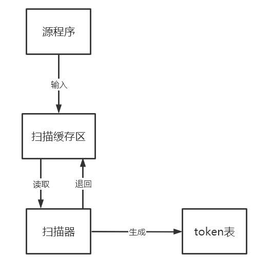
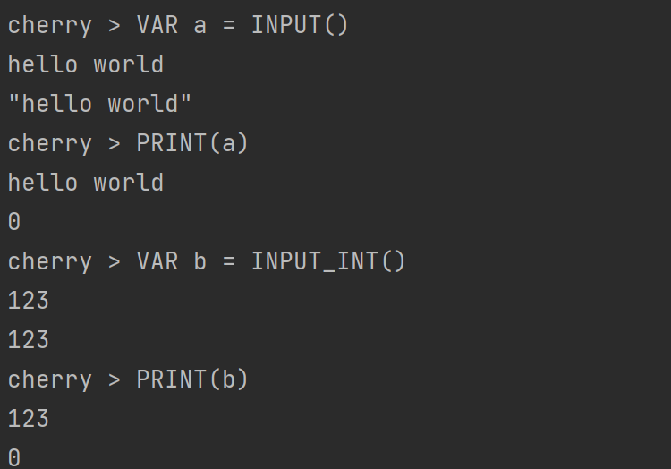
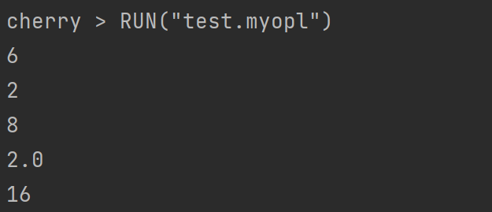
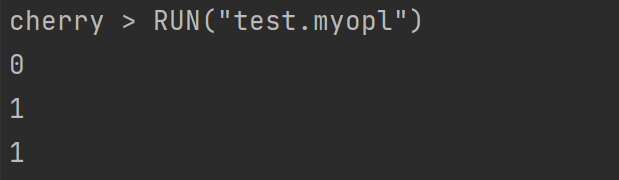
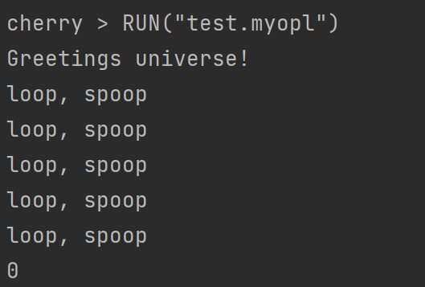
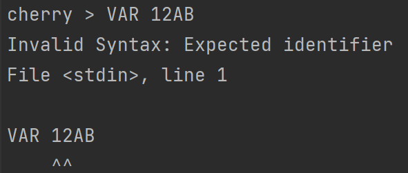
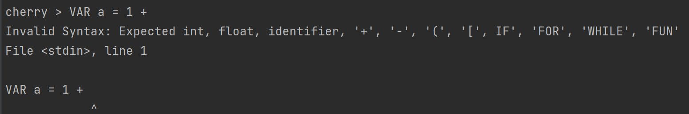
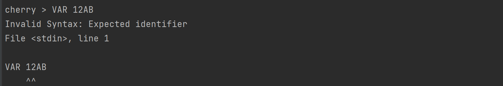

# 程序设计语言原理大作业

组员：ZY2106227 杨润泽；ZY2206321 王悦

##  1 新定义语言的背景和目标

我们实现了一个简单的解释器，可以实现顺序、分支、循环、函数调用以及类定义等等基本的面向对象语言的特性。本解释器基于Python 3实现，代码组织清晰，简单易懂，易于理解内部的构造。定义该语言致力于帮助程序设计员学习者清晰地了解解释器的内部构造，并且能够迅速掌握解释型语言的运行逻辑。

##  2 词法和语法设计

该部分主要介绍本语言的词法和语法设计，包含基本数据类型、变量、运算符、关键词、常用内置函数的词法与语法设计。

### 2.1 基本数据类型
下面是数值类型的EBNF。
```javascript
valueType ::= <INT> | <FLOAT> | <STRING> 
INT ::= [+|-] <digit>
FLOAT ::= <digit>+ '.' <digit>+
STRING ::= [<letter>| <digit>] *
digit ::= [0-9]
letter ::= [a-z] | [A-Z]

```

### 2.2 变量
变量是存储在内存中的值，这就意味着在创建变量时会在内存中开辟一个空间。 基于变量的数据类型，解释器会分配指定内存，并决定什么数据可以被存储在内存中。变量可以指定不同的数据类型，这些变量可以存储整数，小数或字符串。

Cherry中的变量赋值不需要类型声明。每个变量在使用前都必须赋值，变量赋值以后该变量才会被创建。等号 `=` 用来给变量赋值。 等号 `=` 运算符左边是一个变量名，等号 `=` 运算符右边是存储在变量中的值。

```javascript
digit ::= [0-9]
letter ::= [a-z]
        | [A-Z]
identifier ::= [<letter>| '_'] [<letter> | <digit> | '_' ]*
```

### 2.3 运算符

我们给出的运算符包括算数运算符、比较运算符、赋值运算符、逻辑运算符。我们还会给出运算符的优先级的设置。

#### 2.3.1 算数运算符
以下假设变量a为10，变量b为20：


| 运算符符 | 描述                                | 实例                                                         |
| -------- | ----------------------------------- | ------------------------------------------------------------ |
| +        | 加 - 两个对象相加                   | a + b 输出结果 30                                            |
| -        | 减 - 得到负数或是一个数减去另一个数 | a - b 输出结果 -10                                           |
| *        | 乘 - 两个数相乘或是对列表进行拼接   | a * b 输出结果 200;  <br/> [1,2,3] * [4,5,6] 输出结果[1,2,3,4,5,6] |
| /        | 除 - x除以y                         | b / a 输出结果 2                                             |
| ^        | 幂 - 返回x的y次幂                   | a^b 为10的20次方， 输出结果10000000000000000000              |

#### 2.3.2 比较运算符
以下假设变量a为10，变量b为20：

| 运算符 | 描述                                                         | 实例                  |
| ------ | ------------------------------------------------------------ | --------------------- |
| ==     | 等于 - 比较对象是否相等                                      | (a == b) 返回 False。 |
| !=     | 不等于 - 比较两个对象是否不相等                              | (a != b) 返回 True。  |
| \>     | 大于 - 返回x是否大于y                                        | (a > b) 返回 False。  |
| <      | 小于 - 返回x是否小于y。所有比较运算符返回1表示真，返回0表示假。这分别与特殊的变量 True 和 False 等价。 | (a < b) 返回 True。   |
| \>=    | 大于等于 - 返回x是否大于等于y。                              | (a >= b) 返回 False。 |
| <=     | 小于等于 - 返回x是否小于等于y。                              | (a <= b) 返回 True。  |

#### 2.3.3 赋值运算符
以下假设变量a为10，变量b为20：

| 运算符符 | 描述             | 实例                                  |
| -------- | ---------------- | ------------------------------------- |
| =        | 简单的赋值运算符 | c = a + b 将 a + b 的运算结果赋值为 c |

#### 2.3.4 逻辑运算符
以下假设变量a为10，变量b为20：

| 运算符 | 逻辑表达式 | 描述                                                         | 实例                                                         |
| ------ | ---------- | ------------------------------------------------------------ | ------------------------------------------------------------ |
| and    | x and y    | 布尔"与" - 如果 x 为 False，x and y 返回 False，否则它返回 y 的计算值。 | (a and b) 返回 20。                                          |
| or     | x or y     | 布尔"或" - 如果 x 是非 0，它返回 x 的计算值，否则它返回 y 的计算值。 | (a or b)                                           返回 10。 |
| not    | not x      | 布尔"非" - 如果 x 为 True，返回 False 。如果 x 为 False，它返回 True。 | not(a and b)                                       返回 False |

#### 2.3.5 运算符的优先级
以下表格列出了从最高到最低优先级的所有运算符：

| 运算符     | 描述              |
| ---------- | ----------------- |
| ^          | 指数 (最高优先级) |
| * / %      | 乘，除，取模      |
| + -        | 加法减法          |
| <= < > >=  | 比较运算符        |
| == !=      | 等于运算符        |
| =          | 赋值运算符        |
| not and or | 逻辑运算符        |


### 2.4 关键词
关键词是Cherry预先保留的标识符,一共17个关键词，包括基本关键词、控制分支关键词。在定义变量或者常量时候，不能使用关键字，下表给出cherry所有token以及每个关键词所代表的含义。

| 关键词 | 含义       | 关键词   | 含义       |
| ------ | ---------- | -------- | ---------- |
| VAR    | 定义变量   | WHILE    | 循环关键词 |
| FUN    | 定义函数   | FOR      | 循环关键词 |
| AND    | 与运算     | TO       | 循环关键词 |
| OR     | 或运算     | STEP     | 循环关键词 |
| NOT    | 非运算     | RETURN   | 函数返回   |
| IF     | 条件关键词 | CONTINUE | 继续循环   |
| ELSE   | 条件关键词 | BREAK    | 退出循环   |
| ELIF   | 条件关键词 | END      | 结束循环   |
| THEN   | 条件关键词 |          |            |

### 2.5 常用内置函数
#### INPUT() 终端输入
```commandline
VAR a = INPUT()
# 将键盘中输入的字符串/浮点数赋给变量a
```
#### INPUT_INT() 终端输入整数
```commandline
VAR a = INPUT_INT()
# 将键盘中输入的整数赋给变量a。若输入非整数则报错，用户需要重新键入。
```
#### PRINT() 终端输出
```commandline
VAR a = 10
PRINT(a)
# 输出变量a
```
#### CLEAR() 终端清屏
```commandline
CLEAR()
# 清理终端屏幕
```
#### IS_NUM() 判断是否为number
```commandline
VAR a = 10
IS_NUM(a)
# 若为number，则返回1，否则返回0.
```
#### IS_STR() 判断是否为string
```commandline
VAR a = "asbj"
IS_STR(a)
# 若为string，则返回1，否则返回0.
```

#### IS_LIST() 判断是否为list
```commandline
VAR a = [a,b,c]
IS_LIST(a)
# 若为list，则返回1，否则返回0.
```

#### IS_FUN() 判断是否为function
```commandline
FUN function(b, c) -> b + c
IS_FUN(function)
# 若为function，则返回1，否则返回0.
```
#### APPEND(LIST list, item) LIST添加元素
```commandline
VAR list = [1,2,3]
APPEND(list,4)
# list = [1,2,3,4]
```

#### POP(LIST a, index) LIST POP元素
```commandline
VAR list = [1,2,3,4]
POP(list,3)
# 弹出list的第三个元素，即4
```
#### EXTEND(LIST a, LIST b)  拼接两个LIST
```commandline
VAR list = [1,2,3,4]
EXTEND(list,[5,6,7])
# 弹出list的第三个元素，即4
```

### 2.6 词法分析器设计
#### 2.6.1 Tokens的分类
词法分析器的功能是通过输入的源程序，输出单词符号。单词符号是一个程序语言的基本语法符号，在cherry的设计中主要分了以下几类：
> 关键词：由程序语言定义的具有固定意义的标识符，也称保留字或基本字。   
> 标识符：用来表示各种名字，如变量名，函数名等   
> 常数：INT型、FLOAT型   
> 运算符：+,-,*,/等   
> 界符：如分号，左括号，右括号等
#### 2.6.2 单词符号的形式
在cherry中，词法分析器输出的单词符号被表示为携带位置信息的四元式。其中的位置信息用于后续错误的定位。
```commandline
Token(TT_CLASS, TT_VLAUE, pos_start, pos_end)
```
#### 2.6.3 词法分析器的过程
在cherry中，使用串行化的处理风格，将scanner作为一遍。

- 预处理：   
词法分析器工作的第一步是输入源程序文本到输入缓冲区。在cherry中没有专门的预处理工作，而是在词法分析的过程中不处理或跳过无效字符
- 超前搜索：   
识别关键字时需要多读后面的一些字符，以区分不同的语法。
如，!有逻辑否定的作用，也能与'='组合成'!='表示不等于，这时需要再超前搜索一个字符后才能确定，
进而返回识别出的单词，如果这时有多读进的字符，则需要回退处理。


### 2.7 EBNF语法设计

下面我们给出Cherry的EBNF语法设计。

```commandline
statements ::= {<NEWLINE>} <statement> {<NEWLINE><statement>}{<NEWLINE>}

statement ::= 'RETURN'[<expr>]
		   | 'CONTINUE'
		   | 'BREAK'
		   | <expr>

expr ::= 'VAR' <identifier> '=' <expr>
      | <comp-expr> {'AND'|'OR' <comp-expr>}

comp-expr ::= 'NOT' <comp-expr>
           | <arith-expr> {'=='|'<'|'>'|'<='|'>=' <arith-expr>}

arith-expr ::= <term> {'+'|'-' <term>}

term ::= <factor> {'*'|'/' <factor>}

factor ::= ['+'|'-'] <factor>
        | <power>

power ::= <call> {'^' <factor>}

call ::= <atom> ['('[<expr> {',' <expr>}]')']

atom ::= <INT>|<FLOAT>|<STRING>|<IDENTIFIER>
      | '(' <expr> ')'
      | <list-expr>
      | <if-expr>
      | <for-expr>
      | <while-expr>
      | <func-def>

list-expr ::= '[' [<expr> {',' <expr>}] ']'

if-expr ::= 'IF' <expr> 'THEN'(<statement>[<if-expr-b>|<if-expr-c>])
         | (<NEWLINE> <statements> 'END'|<if-expr-b>|<if-expr-c>)

if-expr-b ::= 'ELIF' <expr> 'THEN'(<statement>[<if-expr-b>|<if-expr-c>])
           | (<NEWLINE> <statements> 'END'|<if-expr-b>|<if-expr-c>)

if-expr-c ::= 'ELSE' <statement>
          | (<NEWLINE> <statements> 'END')

for-expr ::= 'FOR' <identifier> '=' <expr> 'TO' <expr> ['STEP' <expr>] 'THEN'
         <statement> | (<NEWLINE> <statements> 'END')

while-expr ::= 'WHILE' <expr> 'THEN' <statement>
           | (<NEWLINE> <statements> 'END')

func-def ::= 'FUN' [<identifier>] 
          '(' (<identifier> {',' <identifier>})? ')' ('->' <expr>)
         | (<NEWLINE> <statements> 'END')
```

### 2.8 抽象语法树
抽象语法树（AST）是用编程语言编写的源代码的抽象语法结构的树表示。
树的每个节点表示在源代码中出现的构造。
语法是“抽象的”，因为它不代表真实语法中出现的每个细节，而只是结构，内容相关的细节。
例如，分组括号在树结构中是隐式的，并且可以通过具有三个分支的单个节点来表示类似于if-condition-then表达式的句法结构。
AST树每一层结构也被叫做节点(Node)。
下面列举比较重要的语句的抽象语法树，其中也包括一些算术表达式和比较表达式的抽象语法树：

#### 2.8.1 分支语句

给出如下输出两个数之间较大的数的分支语句，并画出相应的AST。

```basic
IF a>b THEN 
    PRINT(a)
ELSE
    PRINT(b)
```

AST：

此处插入if-expr-AST.pdf。

#### 2.8.2 循环语句

给出如下输出0到10之间整数的循环语句，并画出相应的AST。

```basic
FOR i = 0 TO 10 THEN
	PRINT('i')
END
```

AST：

此处插入for-expr-AST.pdf。

#### 2.8.3 函数定义

定义如下返回两数之和的简单函数，并画出相应的AST。

```basic
FUN sum(a, b) -> a + b
```

AST：

此处插入func-def-AST.pdf。

## 3 范型设计


## 4 指称语义

### 4.1 存储域与辅助函数
```
Store = Location → (stored Storable + undefined + unused)
empty_store : Store 
allocate : Store → Store × Location 
deallocate : Store × Location → Store 
update : Store × Location × Storable→Store 
fetch : Store × Location → Storable

empty_store = λloc.unused
allocate sto =
	let loc = any_unused_location (sto) in
		let loc = any_unused_location (sto) in
deallocate (sto，loc) = sto [loc → unused]
update (sto，loc，stble) = sto [loc→stored stble]
fetch (sto，loc) =
	let stored_value (stored stble) = stble
		stored_value (undefined) = fail
		stored_value (unused) = fail
	in
		stored_value (sto(loc))
```
### 4.2 环境域与辅助函数
```
Environ = ldentifier→(bound Bindable + unbound)
empty_environ : Environ
bind : ldentifier×Bindable → Environ
overlay : Environ×Environ → Environ
find : Environ×ldentifier→Bindable

enpty_environ = λI. unbound
bind(I,bdble) = λI'.if I'=I then bound bdble else unbound
overlay (env'，env) =
	λI. if env'(I)/=unbound then env’(I) else env(I)
find(env,I) =
	let bound_value(bound bdble) = bdble
		bound_value(unbound) = ⊥
	in
		bound_value(env(I))
```
### 4.3 基本操作
操作数的值：
```
Value = truth_value Truth_Value + integer Integer
```
可存储值：
```
Storable = Value
```
可束定体：
```
Bindable = value Value + variable Location
```
执行命令的语义函数：
```
execute: Command → (Environ → Store → Store)
```
语义等式：
```
execute〖C〗 env sto = sto’
```
表达式求值的语义函数：
```
evaluate: Expression → (Environ → Store → Value) 
```
语义等式：
```
evaluate 〖E〗 env sto= Value
```
声明的语义函数：
```
elaborate: Declaration→ (Environ → Store → Environ×store) 
```
语义等式：
```
elaborate〖D〗 env sto =(env’,sto’)
```
取值辅助函数：
```
coerce: Store×Bindable→Value
coerce(sto，find(env，I))
	=val
	|fetch(sto，loc)
```
标识符求值：
```
evaluete〖I〗env sto = coerce(sto，find(env，I))
```
变量声明：
```
elaborate〖VAR I〗env sto =
	let (sto'，loc)= allocate sto in
	(bind(I，variable loc)，sto')
```
变量赋值：
```
execute〖I = E〗env sto =
	let val = evaluate E env sto in
	let variable loc = find(env，I) in
	update(sto，loc，val)
```
### 4.4 基本运算
辅助函数：
```
sum: Number × Number → Number
minus: Number × Number → Number
product: Number × Number → Number
divide: Number × Number → Number
power: Number × Number → Number
not: Truth_Value → Truth_Value
more : Number ×Number → Truth_Value
less : Number ×Number → Truth_Value
equal : Number ×Number → Truth_Value
geq : Number ×Number → Truth_Value
leq : Number ×Number → Truth_Value
```
语义等式：
```
evaluate〖E1 + E2〗env sto =
     let Number n1 = evaluate E1 env sto in
     let Number n2 = evaluate E2 env sto in
     integer(sum( n1，n2 ))
evaluate〖E1 - E2〗env sto =
     let Number n1 = evaluate E1 env sto in
     let Number n2 = evaluate E2 env sto in
     integer(minus( n1，n2 ))
evaluate〖E1 * E2〗env sto =
     let Number n1 = evaluate E1 env sto in
     let Number n2 = evaluate E2 env sto in
     integer(product( n1，n2 ))
evaluate〖E1 / E2〗env sto =
     let Number n1 = evaluate E1 env sto in
     let Number n2 = evaluate E2 env sto in
     integer(divide( n1，n2 ))
evaluate〖E1 ^ E2〗env sto =
     let Number n1 = evaluate E1 env sto in
     let Number n2 = evaluate E2 env sto in
     integer(power( n1，n2 ))
evaluate〖E1 < E2〗env sto =
     let Number n1 = evaluate E1 env sto in
     let Number n2 = evaluate E2 env sto in
     truth_value (less(n1，n2)) 
evaluate〖E1 > E2〗env sto =
     let Number n1 = evaluate E1 env sto in
     let Number n2 = evaluate E2 env sto in
     truth_value (greater(n1，n2)) 
evaluate〖E1 == E2〗env sto =
     let Number n1 = evaluate E1 env sto in
     let Number n2 = evaluate E2 env sto in
     truth_value (equal(n1，n2)) 
evaluate〖E1 <= E2〗env sto =
     let Number n1 = evaluate E1 env sto in
     let Number n2 = evaluate E2 env sto in
     truth_value (leq(n1，n2)) 
evaluate〖E1 >= E2〗env sto =
     let Number n1 = evaluate E1 env sto in
     let Number n2 = evaluate E2 env sto in
     truth_value (geq(n1，n2)) 
evaluate〖NOT E〗env sto =
     let truth_value tr = evaluate E env sto in
     truth_value(not(tr))
evaluate〖E1 AND E2〗env sto =
	if evaluate E1 env sto = truth_value true
	then if evaluate E2 env sto = truth_value true
		then truth_value true
		else truth_value false
	else truth_value false
evaluate〖E1 OR E2〗env sto =
	if evaluate E1 env sto = truth_value true
	then truth_value true
	else if evaluate E2 env sto = truth_value true
		then truth_value true
		else truth_value false
```
### 4.5 分支
```
execute〖IF E THEN C1 ELSE C2〗env sto =
	if evaluate E env sto = truth_value true
	then execute C1 env sto
	else execute C2 env sto
```
### 4.6 循环
```
execute〖FOR I = E1 TO E2 THEN C END〗env sto =
	execute I = E1 env sto
	let execute_for env sto =
		if evaluate I<E2 env sto = truth_value true
		then execute_for env ( execute C env sto)
		else sto
	in
	execute_for

execute〖WHILE  E THEN C END〗=
	let execute_while env sto =
		if evaluate E env sto = truth_value true
		then execute_while env (execute C env sto)
		else sto
	in 
	execute_while
```
### 4.7 函数
```
Function = Argument→Store→Value
bind_parameter: Formal_Parameter→(Argument→Environ)
give_argument : Actual_Parameter→(Environ→Argument)

Argument = Value
Bindable = value Value + variable Location + function Function
```
参数束定：
```
bind_parameter〖I:T〗arg = bind(I，arg)
give_argument〖E〗env = evaluate E env
```
函数调用的语义等式:
```
evaluate〖I(AP)〗env =
	evaluate〖I(AP)〗env =
	let arg = give_argument AP env in
	func arg
```
函数声明的语义等式：
```
elaborate〖FUN I(FP) -> E 〗env =
	let func arg =
		let parenv = bind_parameter FP arg in
		evaluate E(overlay(parenv，env))
	in
(bind(I，function func))
```
## 5 与对标语言的差异
与basic相比，cherry语言有如下特点
- 在cherry中，取消了GOTO语句。 GOTO语句可以灵活跳转会导致破坏结构化设计风格，若一段代码多次使用goto语句会降低代码的可读性。其次，GOTO语句的执行可能会跳过变量的初始化、重要的计算语句等，甚至影响到整个程序的运行。
- 在Basic上拓展了IF-THEN语句，cherry还可支持IF-THEN-ELSE，IF-THEN-ELIF-THEN-ELSE。通过条件控制语句还能进一步实现witch功能。
- 在Basic中变量命名只能两个字符，cherry的变量命名长度不受限制
- Basic的循环语句只有FOR，cherry还增加了WIILE循环语句
## 6 实现与测试
### 6.1 测试代码
#### I/O操作
```
VAR a = INPUT()
PRINT(a)
VAR b = INPUT_INT()
PRINT(b)
```
测试结果  



#### 算术运算
```
VAR a = 4
VAR b = 2
PRINT(a + b)
PRINT(a - b)
PRINT(a * b)
PRINT(a / b)
PRINT(a ^ b)
```
测试结果  



#### 逻辑运算
```
VAR a = 1
VAR b = 0
PRINT(a AND b)
PRINT(a OR b)
PRINT(NOT b)
```
测试结果  



#### 函数
```
# This is a very useful piece of software

FUN oopify(prefix) -> prefix + "oop"

FUN join(elements, separator)
	VAR result = ""
	VAR len = LEN(elements)

	FOR i = 0 TO len THEN
		VAR result = result + elements/i
		IF i != len - 1 THEN VAR result = result + separator
	END

	RETURN result
END

FUN map(elements, func)
	VAR new_elements = []

	FOR i = 0 TO LEN(elements) THEN
		APPEND(new_elements, func(elements/i))
	END

	RETURN new_elements
END

PRINT("Greetings universe!")

FOR i = 0 TO 5 THEN
	PRINT(join(map(["l", "sp"], oopify), ", "))
END

```
测试结果  



### 6.2 错误示范
在cherry中，提供精准的错误定位和错误类型分析，方便编程人员及时发现自己的错误。   
  
#### 关键词错误
```
VAR 12AB
```
 

#### 缺少符号
```
VAR a = 1 + 
```


#### 变量未定义
```
A = 1
```
